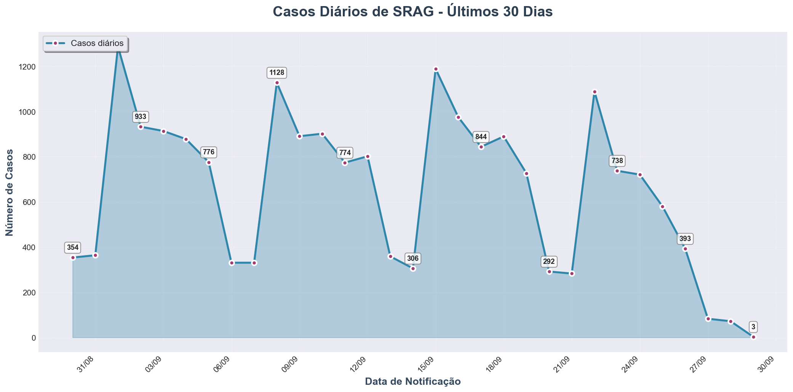
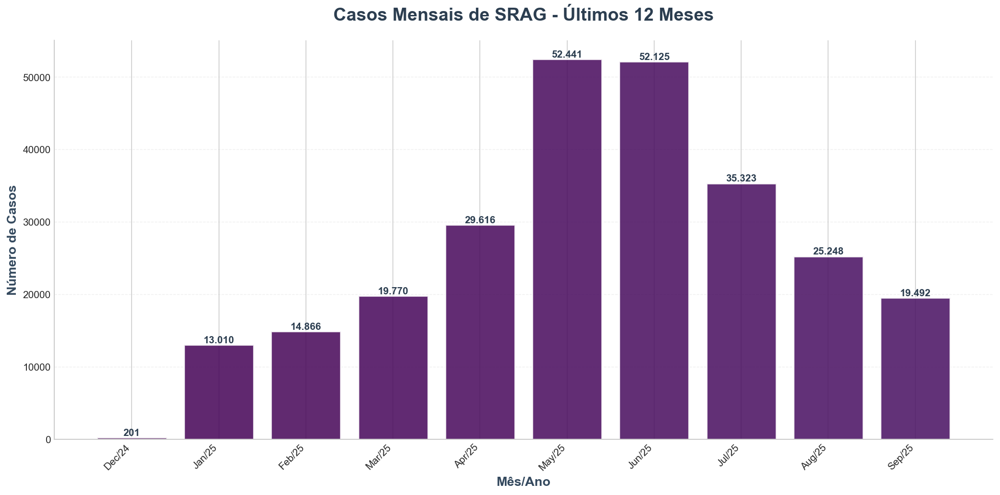

# Relatório Técnico sobre SRAG - Análise do Dia 29/09/2025

## Introdução
Este relatório apresenta uma análise dos dados epidemiológicos relacionados à Síndrome Respiratória Aguda Grave (SRAG) para o dia 29 de setembro de 2025. Os dados incluem a taxa de crescimento de casos, taxa de mortalidade, taxa de ocupação de UTI e taxa de vacinação.

## Dados Epidemiológicos

### Taxa de Crescimento de Casos
- **Valor**: -0.9583
- **Interpretação**: A taxa de crescimento negativa sugere uma diminuição no número de novos casos de SRAG. Essa tendência de queda é encorajadora e pode indicar que as medidas de controle e prevenção estão surtindo efeito, resultando em uma redução na transmissão do vírus.

### Taxa de Mortalidade
- **Valor**: 0.0
- **Interpretação**: A ausência de óbitos registrados relacionados a SRAG no período analisado é um sinal positivo. Isso sugere que as intervenções de saúde pública estão sendo eficazes na prevenção de complicações graves e na proteção da população.

### Taxa de Ocupação de UTI
- **Valor**: 0.0
- **Interpretação**: A taxa de ocupação de UTI de 0.0 indica que não há pacientes internados em unidades de terapia intensiva devido a SRAG. Este dado reflete uma situação positiva, mostrando que a gravidade dos casos está sob controle e que o sistema de saúde não está sobrecarregado.

### Taxa de Vacinação
- **Valor**: 66.67%
- **Interpretação**: A taxa de vacinação de 66.67% é um dado promissor, indicando que uma parte significativa da população já recebeu a vacina. Isso é crucial para a imunização coletiva e pode estar contribuindo para a redução de casos e a proteção da saúde pública.

## Gráficos

### Casos Diários (Últimos 30 Dias)

### Casos Mensais (Últimos 12 Meses)

## Análise dos Resultados
Os dados apresentados indicam uma situação epidemiológica favorável em relação à SRAG no dia 29 de setembro de 2025. A combinação de uma taxa de crescimento de casos negativa, a ausência de mortalidade e a baixa taxa de ocupação de UTI sugere que as medidas de saúde pública estão sendo eficazes. Além disso, a taxa de vacinação de 66.67% é um fator importante que pode estar contribuindo para a proteção da população e a redução da transmissão do vírus.

## Conclusão
Os dados analisados para o dia 29 de setembro de 2025 mostram uma tendência positiva no controle da SRAG, com uma redução no número de casos e a manutenção de uma situação estável em relação à gravidade dos casos e à ocupação hospitalar. A vacinação continua a ser um pilar fundamental na proteção da saúde pública.